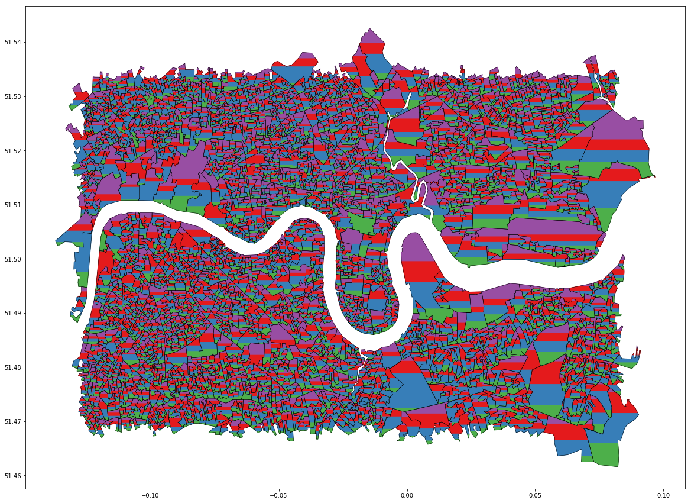

# Proportional polygon choropleth

A little function usefull for displaying multiple variables related to a polygon in a choropleth map way. Standard visualisations for this sort of data is displaying a histogram inside the polygon, which i'm not really keen on how it looks. Instead, the polygons are proportionally segmented based on the attributes provided. A disadvantage is that the scale of values gets normalised between 0-1 which may or may not be desired.

